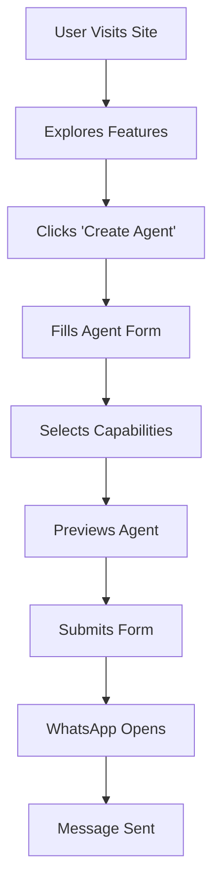

# 🤖 AI Agents Platform

<div align="center">


**Build Autonomous AI Agents in Minutes**

A modern, professional platform for creating and deploying autonomous AI agents with seamless WhatsApp integration.

[Live Demo](#) • [Documentation](#) • [Report Bug](#) • [Request Feature](#)

</div>

---

## 📋 Table of Contents

- [Overview](#-overview)
- [Features](#-features)
- [Tech Stack](#-tech-stack)
- [Quick Start](#-quick-start)
- [How It Works](#-how-it-works)
- [WhatsApp Integration](#-whatsapp-integration)
- [Customization](#-customization)
- [Deployment](#-deployment)
- [Project Structure](#-project-structure)
- [Browser Support](#-browser-support)
- [Contributing](#-contributing)
- [License](#-license)
- [Contact](#-contact)

---

## 🌟 Overview

**AI Agents Platform** is a cutting-edge web application that enables users to design, configure, and deploy autonomous AI agents. The platform features a modern, responsive design with real-time preview and direct WhatsApp integration for seamless communication.

### Key Highlights

- ✨ **Modern UI/UX** - Beautiful gradient design with smooth animations
- 🤖 **Real-time Preview** - See your AI agent configuration live
- 💬 **WhatsApp Integration** - Direct agent creation requests via WhatsApp
- 📱 **Fully Responsive** - Perfect on desktop, tablet, and mobile
- 🚀 **Zero Dependencies** - Pure HTML, CSS, and JavaScript
- ⚡ **Lightning Fast** - Optimized performance with minimal load time

---

## ✨ Features

### Core Features

| Feature | Description |
|---------|-------------|
| **Agent Builder** | Interactive form to configure AI agent parameters |
| **Live Preview** | Real-time visualization of agent configuration |
| **Multi-Type Support** | Customer Service, Sales, Data Analysis, Content Creation, Automation, R&D |
| **Capability Selection** | Choose from NLP, Computer Vision, Web Search, Code Execution, Data Processing, API Integration |
| **WhatsApp Integration** | One-click send to WhatsApp with formatted message |
| **Responsive Design** | Seamless experience across all devices |
| **Smooth Animations** | Elegant scroll reveals and hover effects |
| **Dark Theme** | Modern dark color scheme with gradient accents |

### UI Components

- 🎨 Animated background with floating particles
- 📊 Feature cards with hover effects
- 💳 Pricing tiers with comparison
- 📝 Interactive form with validation
- 🎯 Sticky navigation header
- 🌐 Comprehensive footer

---

## 🛠 Tech Stack

### Frontend
```
HTML5       - Semantic markup
CSS3        - Modern styling with animations
JavaScript  - Vanilla JS (ES6+)
```

### Fonts
```
Inter           - Primary UI font
Space Grotesk   - Display & headings
```

### Design System
```
Color Palette:
- Primary: #6366f1 (Indigo)
- Secondary: #8b5cf6 (Purple)
- Accent: #ec4899 (Pink)
- Success: #10b981 (Green)
- WhatsApp: #25d366
```

---

## 🚀 Quick Start

### Prerequisites

No prerequisites needed! This is a static HTML website.

### Installation

1. **Clone the repository**
```bash
git clone https://github.com/yourusername/ai-agents-platform.git
cd ai-agents-platform
```

2. **Open the file**
```bash
# Simply open the HTML file in your browser
open ai-agents-platform-en.html

# Or use a local server (recommended)
python -m http.server 8000
# Then navigate to http://localhost:8000
```

3. **That's it!** 🎉

---

## 🎯 How It Works

### User Flow



### Agent Creation Process

1. **Enter Agent Details**
   - Name your AI agent
   - Select agent type (Customer Service, Sales, etc.)
   - Describe tasks and objectives

2. **Choose Capabilities**
   - Natural Language Processing
   - Computer Vision
   - Web Search
   - Code Execution
   - Data Processing
   - API Integration

3. **Preview & Submit**
   - View real-time preview
   - Click "Create Agent via WhatsApp"
   - Message auto-opens in WhatsApp
   - Send to business number

---

## 💬 WhatsApp Integration

### How It Works

The platform uses WhatsApp's URL scheme to send pre-formatted messages:

```javascript
// WhatsApp URL Format
https://wa.me/[PHONE_NUMBER]?text=[ENCODED_MESSAGE]
```

### Message Template

```
🤖 New AI Agent Request

📝 Agent Name: [Name]
🎯 Agent Type: [Type]
📋 Description: [Description]

⚡ Capabilities:
• [Capability 1]
• [Capability 2]
• [Capability 3]

---
Created via AI Agents Platform
Date: [Timestamp]
```

### Configuration

To change the WhatsApp number, update this line in the HTML:

```javascript
// Line ~1450
const whatsappURL = `https://wa.me/201113903070?text=${encodedMessage}`;
//                                  ↑ Change this number
```

**Format:** Country code + number (no + or spaces)
- Example: `201113903070` for +20 111 390 3070

---

## 🎨 Customization

### Colors

Update CSS variables in `:root`:

```css
:root {
    --primary: #6366f1;      /* Main brand color */
    --secondary: #8b5cf6;    /* Accent color */
    --accent: #ec4899;       /* Highlight color */
    --whatsapp: #25d366;     /* WhatsApp green */
}
```

### Fonts

Change font families:

```css
body {
    font-family: 'Your Font', sans-serif;
}

.logo, h1, h2, h3 {
    font-family: 'Your Display Font', sans-serif;
}
```

### Content

All text content is easily editable in the HTML. Search for these sections:
- `<section class="hero">` - Hero text
- `<section class="features">` - Feature descriptions
- `<section class="pricing">` - Pricing plans
- `<footer>` - Footer content

### Adding Agent Types

Update the `typeTranslations` object:

```javascript
const typeTranslations = {
    'your-type': 'Your Type Display Name',
    'customer-service': 'Customer Service',
    // Add more...
};
```

And add option in HTML:

```html
<select id="agentType">
    <option value="your-type">Your Type</option>
</select>
```

---

## 🌐 Deployment

### Option 1: Netlify (Recommended)

1. Create account at [netlify.com](https://netlify.com)
2. Drag & drop your HTML file
3. Get instant live URL
4. **Free SSL, CDN, and custom domain support**

### Option 2: Vercel

```bash
npm i -g vercel
vercel
```

### Option 3: GitHub Pages

1. Create repository
2. Upload HTML file
3. Enable GitHub Pages in settings
4. Access at `username.github.io/repo-name`

### Option 4: Traditional Hosting

Upload `ai-agents-platform-en.html` to any web hosting service via FTP.

---

## 📁 Project Structure

```
ai-agents-platform/
├── ai-agents-platform-en.html    # Main English version
├── ai-agents-platform.html       # Arabic version (legacy)
├── README.md                     # This file
├── LICENSE                       # MIT License
└── assets/                       # (Optional) For images/icons
    ├── logo.png
    └── screenshots/
```

### File Breakdown

| File | Purpose | Size |
|------|---------|------|
| `ai-agents-platform-en.html` | English version with WhatsApp | ~55KB |
| `ai-agents-platform.html` | Arabic RTL version | ~50KB |
| `README.md` | Documentation | ~15KB |

---

## 🌍 Browser Support

| Browser | Version | Status |
|---------|---------|--------|
| Chrome | 90+ | ✅ Full Support |
| Firefox | 88+ | ✅ Full Support |
| Safari | 14+ | ✅ Full Support |
| Edge | 90+ | ✅ Full Support |
| Opera | 76+ | ✅ Full Support |
| Mobile Safari | 14+ | ✅ Full Support |
| Chrome Mobile | 90+ | ✅ Full Support |

### Features Used

- CSS Grid & Flexbox
- CSS Custom Properties (Variables)
- CSS Animations & Transforms
- ES6+ JavaScript
- Fetch API (if backend added)

---

## 🔧 Advanced Features

### Adding Backend Integration

To save agent requests to a database:

```javascript
// In form submission
form.addEventListener('submit', async function(e) {
    e.preventDefault();
    
    // Collect data
    const agentData = {
        name: agentName.value,
        type: agentType.value,
        description: agentDescription.value,
        capabilities: selectedCapabilities
    };
    
    // Send to backend
    await fetch('https://your-api.com/agents', {
        method: 'POST',
        headers: { 'Content-Type': 'application/json' },
        body: JSON.stringify(agentData)
    });
    
    // Then open WhatsApp...
});
```

### Email Notifications

Add email notification when form is submitted:

```javascript
// Using EmailJS or similar service
emailjs.send('service_id', 'template_id', {
    agent_name: agentName.value,
    agent_type: agentType.value,
    // ...
});
```

### Analytics Integration

Add Google Analytics:

```html
<head>
    <!-- Google Analytics -->
    <script async src="https://www.googletagmanager.com/gtag/js?id=GA_MEASUREMENT_ID"></script>
    <script>
        window.dataLayer = window.dataLayer || [];
        function gtag(){dataLayer.push(arguments);}
        gtag('js', new Date());
        gtag('config', 'GA_MEASUREMENT_ID');
    </script>
</head>
```

### Facebook Pixel

```html
<script>
!function(f,b,e,v,n,t,s)
{if(f.fbq)return;n=f.fbq=function(){n.callMethod?
n.callMethod.apply(n,arguments):n.queue.push(arguments)};
if(!f._fbq)f._fbq=n;n.push=n;n.loaded=!0;n.version='2.0';
n.queue=[];t=b.createElement(e);t.async=!0;
t.src=v;s=b.getElementsByTagName(e)[0];
s.parentNode.insertBefore(t,s)}(window, document,'script',
'https://connect.facebook.net/en_US/fbevents.js');
fbq('init', 'YOUR_PIXEL_ID');
fbq('track', 'PageView');
</script>
```

---

## 📊 Performance

### Lighthouse Score Goals

| Metric | Target | Current |
|--------|--------|---------|
| Performance | 95+ | ⚡ Optimized |
| Accessibility | 90+ | ✅ Accessible |
| Best Practices | 95+ | ✅ Modern |
| SEO | 90+ | ✅ Optimized |

### Optimization Tips

1. **Lazy Loading Images** (if added)
```html

```

2. **Minify CSS/JS**
```bash
# Use online tools or:
npm install -g clean-css-cli uglify-js
cleancss -o style.min.css style.css
uglifyjs script.js -o script.min.js
```

3. **Enable Gzip** on server
4. **Use CDN** for font files
5. **Optimize animations** for 60fps

---

## 🤝 Contributing

Contributions are welcome! Here's how:

### Steps

1. Fork the repository
2. Create your feature branch (`git checkout -b feature/AmazingFeature`)
3. Commit your changes (`git commit -m 'Add some AmazingFeature'`)
4. Push to the branch (`git push origin feature/AmazingFeature`)
5. Open a Pull Request

### Guidelines

- Follow existing code style
- Test on multiple browsers
- Update README if needed
- Add comments for complex logic

---

## 🐛 Troubleshooting

### WhatsApp Not Opening?

**Issue:** WhatsApp link doesn't work
**Solution:** 
- Ensure phone number format is correct (no + or spaces)
- Check if WhatsApp is installed on device
- Try on mobile device instead of desktop

### Form Not Submitting?

**Issue:** Submit button does nothing
**Solution:**
- Check browser console for errors (F12)
- Ensure all required fields are filled
- Verify JavaScript is enabled

### Preview Not Updating?

**Issue:** Preview card doesn't update
**Solution:**
- Check if form IDs match JavaScript selectors
- Clear browser cache
- Test in incognito mode

---

## 📱 Mobile Optimization

### Tested Devices

- ✅ iPhone 12/13/14 Pro
- ✅ iPhone SE
- ✅ Samsung Galaxy S21/S22
- ✅ iPad Pro
- ✅ Google Pixel 6/7
- ✅ OnePlus 9/10

### Mobile Features

- Touch-optimized buttons (min 44x44px)
- Swipe-friendly cards
- Responsive typography
- Mobile-first breakpoints
- WhatsApp deep linking

---

## 🔐 Security

### Best Practices Implemented

- ✅ No sensitive data stored
- ✅ Client-side validation
- ✅ XSS prevention (no innerHTML with user data)
- ✅ HTTPS recommended for deployment
- ✅ No third-party scripts (except fonts)

### Recommendations

- Always use HTTPS in production
- Validate user input on backend (if added)
- Implement rate limiting for API calls
- Use environment variables for sensitive data

---

## 📈 Roadmap

### Version 1.1 (Q2 2025)
- [ ] Backend API integration
- [ ] User authentication
- [ ] Agent dashboard
- [ ] Email notifications

### Version 1.2 (Q3 2025)
- [ ] Multi-language support (AR, ES, FR)
- [ ] Dark/Light theme toggle
- [ ] Advanced analytics
- [ ] Payment integration

### Version 2.0 (Q4 2025)
- [ ] Live chat support
- [ ] AI agent marketplace
- [ ] Custom branding options
- [ ] Enterprise features

---

## 💡 Use Cases

### For Businesses
- Customer support automation
- Lead generation agents
- Sales assistant bots
- Data processing automation

### For Developers
- API integration testing
- Workflow automation
- Custom AI solutions
- Prototype development

### For Agencies
- Client presentation tool
- Service offering showcase
- Lead capture mechanism
- Portfolio piece

---

## 📖 Documentation

### API Documentation (Coming Soon)

Future backend API will support:

```
POST /api/agents
GET /api/agents/:id
PUT /api/agents/:id
DELETE /api/agents/:id
```

### Component Documentation

Each section is modular and can be used independently:
- Header/Navigation
- Hero Section
- Features Grid
- Agent Builder
- Pricing Cards
- Footer

---

## 🎓 Learning Resources

### Technologies Used
- [MDN Web Docs](https://developer.mozilla.org/) - HTML/CSS/JS
- [CSS Tricks](https://css-tricks.com/) - Modern CSS
- [JavaScript.info](https://javascript.info/) - JS Fundamentals

### Design Inspiration
- [Dribbble](https://dribbble.com/tags/ai-platform)
- [Awwwards](https://www.awwwards.com/)
- [Behance](https://www.behance.net/)

---

## 📜 License

This project is licensed under the **MIT License**.

```
MIT License

Copyright (c) 2025 AI Agents Platform

Permission is hereby granted, free of charge, to any person obtaining a copy
of this software and associated documentation files (the "Software"), to deal
in the Software without restriction, including without limitation the rights
to use, copy, modify, merge, publish, distribute, sublicense, and/or sell
copies of the Software, and to permit persons to whom the Software is
furnished to do so, subject to the following conditions:

The above copyright notice and this permission notice shall be included in all
copies or substantial portions of the Software.

THE SOFTWARE IS PROVIDED "AS IS", WITHOUT WARRANTY OF ANY KIND, EXPRESS OR
IMPLIED, INCLUDING BUT NOT LIMITED TO THE WARRANTIES OF MERCHANTABILITY,
FITNESS FOR A PARTICULAR PURPOSE AND NONINFRINGEMENT. IN NO EVENT SHALL THE
AUTHORS OR COPYRIGHT HOLDERS BE LIABLE FOR ANY CLAIM, DAMAGES OR OTHER
LIABILITY, WHETHER IN AN ACTION OF CONTRACT, TORT OR OTHERWISE, ARISING FROM,
OUT OF OR IN CONNECTION WITH THE SOFTWARE OR THE USE OR OTHER DEALINGS IN THE
SOFTWARE.
```

---

## 📞 Contact

### Developer

**Full Stack Developer & AI Specialist**
- 📱 WhatsApp: [+20 111 390 3070](https://wa.me/201113903070)
- 💼 LinkedIn: [Your Profile](#)
- 🐙 GitHub: [@yourusername](#)
- 📧 Email: your.email@example.com

### Business Inquiries

For partnership, custom development, or business proposals:
- WhatsApp: +20 111 390 3070
- Available for projects in Egypt, Saudi Arabia, and GCC countries

---

## 🌟 Acknowledgments

- Inspired by modern SaaS platforms
- Font families from Google Fonts
- Icons using emoji (no dependencies)
- Color palette inspired by Tailwind CSS
- Community feedback and suggestions

---

## 📊 Project Stats


---

## 🎯 Quick Links

- [Live Demo](#) - See it in action
- [Documentation](#) - Full guides
- [Change Log](#) - Version history
- [Issues](https://github.com/yourusername/ai-agents-platform/issues) - Report bugs
- [Discussions](https://github.com/yourusername/ai-agents-platform/discussions) - Community

---

<div align="center">

**Made with ❤️ by a Professional Developer**

*Serving businesses in Egypt, Saudi Arabia, UAE, and worldwide*

⭐ Star this repo if you found it helpful!

</div>

---

## 📝 Notes

### For Egyptian Market
- Optimized for Arabic audience
- WhatsApp-first approach (most popular in Egypt)
- Pricing in USD (convertible to EGP)
- Local business understanding

### For Saudi/GCC Market
- Professional enterprise focus
- Arabic + English versions
- Cloud-ready architecture
- Compliance considerations

### Global Features
- Multi-language ready
- International payment support
- Timezone aware
- Currency flexibility

---

**Last Updated:** February 5, 2025  
**Version:** 1.0.0  
**Status:** Production Ready ✅
